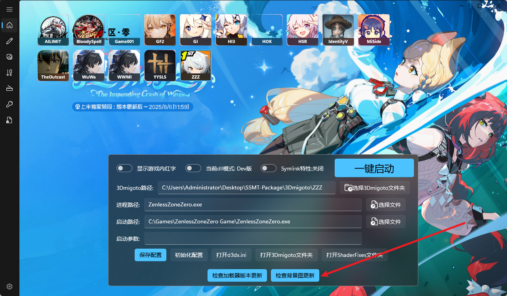

# SSMT-Package

- 直接点击绿色的按钮打包下载后，解压到一个文件夹里，然后在SSMT的设置里把SSMT的总工作空间文件夹设置为这里下载下来解压出来的目录即可使用，这里要点击选择文件夹来进行设置，不要直接填写。

# 为什么部分游戏未提供自带的3Dmigoto加载器？
因为这些游戏的3Dmigoto加载器更新过于频繁，你可以点击【检查加载器版本更新】来全自动连接对应Github仓库下载对应的3Dmigoto加载器，部分加载器的内容是完全和XXMI Launcer同步的，并且下载完成后会全自动配置好，此功能仅支持部分游戏。

# 为什么部分游戏背景图很久不更新？

部分游戏（米游戏）可以点击【检查背景图更新】来全自动更新背景图，其它游戏没有自动更新背景图的必要，可自行去SSMT-Package的Games目录下对应游戏名的文件夹中自行替换为自己想要的图片。

# WuWa和WWMI有啥区别？

在SSMT中WuWa的数据类型全是适用于SSMT的，WWMI的数据类型是给WWMI-Tools准备的，

只使用SSMT生成Mod选择WuWa，只使用WWMI-Tools生成Mod选择WWMI

# 提示

SSMT及其相关工具仅用于基于模组的二创视频制作，禁止用于其它用途，请确保使用合规，

此仓库内容全部是测试内容，随时可能发生变动，无法保证所有功能都完善，有问题请提交issue反馈。

