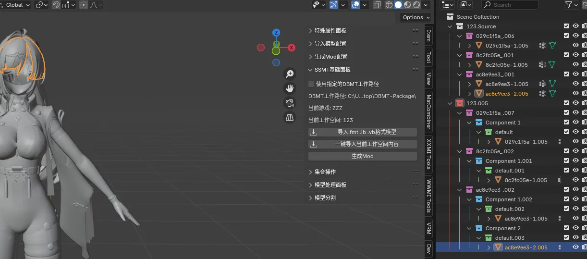

## V1.6.1
- HSR现在生成Mod时，会读取tmp.json里的OriginalVertexCount字段来决定是否生成VertexLimitRaise部分，如果大于OriginalVertexCount才会生成，这个新机制修复了当生成Mod的顶点数少于原本模型顶点数时模型消失的BUG。（需配合SSMT## V1.2.2.3或以上版本才能生效）
## V1.6.0
- 修复了一个UnityCS生成Mod的ini时报错的BUG。
## V1.5.9
- 鸣潮生成Mod执行速度提高，满足一般使用需求。
## V1.5.8
- 移除了读取fmt文件中的flip_normal用法，因为这是错误的。
- 现在3.6版本导入模型会勾选自动平滑了。
## V1.5.7
- 新增读取fmt文件中的flip_face_orientation属性来控制是否在导入时翻转面朝向。（现在使用最新版DBMT提取导入WWMI、YYSLS提取的模型后，面朝向是正常的了）
- 现在WWMI和YYSLS会在导出Mod时自动翻转面朝向。
- 现在WWMI和YYSLS导出Mod时不再翻转NORMAL了，因为有面朝向翻转保证正确。
## V1.5.6
- 优化鸣潮生成Mod执行速度
## V1.5.5
- 修复了WWMI在使用3.6制作时被错误翻转法线的BUG。
## V1.5.4
- WWMI也可以使用新版集合架构了。
## V1.5.3
- YYSLS ini格式更新，解决了vb放在ib下面替换时导致阴影不正确的问题。
- 所有集合架构支持的ini中的DrawIndexed现在会根据条件进行分组了，不再各自单独为组。
- UnityCS与UnityVS格式更新，解决了物体类型Mod阴影不正确的BUG。
## V1.5.2
- 第五人格ini格式更新
## V1.4.2
- 现在除了WWMI外，生成Mod时默认只使用标记过的贴图，不再使用全局的Hash贴图替换，WWMI则依然能看见【只使用标记的贴图】选项，且默认为未勾选状态。现在除了WWMI之外，不会全局都搞过来替换了，只会用你标记的，不标记用不了。
## V1.4.1
- 现在一键导入工作空间会导入一个Source源集合和一个工作空间为名称的集合，源集合的作用是存储游戏中导入的源模型，方便复用，生成Mod仍然选中工作空间集合。

## V1.4.0
- 修复了权重缺少归一化导致自定义模型无法得到完美权重的BUG。
## V1.3.9
- 修复了逆向出的模型文件无法导入Blender的BUG。
## V1.3.8
- 修复了HSR的Mod按下F6关闭Mod后炸裂的问题(记得把DBMT-Package更新到最新版)。
## V1.3.7
- 集合的链接物体和取消链接物体加入面板方便操作。
## V1.3.6
- 新增集合的链接物体和取消链接物体。
## V1.3.5
- 现在所有游戏都可以使用完整贴图标记流程了，例如YYSLS、IdentityV。
## V1.3.4
- 燕云十六声导出的NORMAL和BINORMAL调整，现已100%还原游戏内渲染阴影效果。
## V1.3.3
- 新增读取fmt文件中的flip_normal属性来控制是否在导入时翻转法线，适用于WWMI。（现在使用最新版DBMT提取导入鸣潮提取的模型后，法线是正常的了）
- 修复了WWMI导入时VG Remap无法生效的问题。
- 修复了鸣潮Mod制作的的形态键不正确问题。
- 新增读取fmt文件中的flip_winding属性来控制是否在导入时翻转面朝向。（现在使用最新版DBMT提取导入鸣潮提取的模型后，面朝向是正常的了）
- 新增读取fmt文件中的flip_mirror属性来控制是否在导入时镜像模型。（现在使用最新版DBMT提取导入鸣潮提取的模型后，模型镜像是正常的了）

## V1.3.2
- 移除自动更新面板。
- 新增读取fmt文件中的rotate_angle属性来控制是否在导入时设置模型旋转角度，默认为False。
- 移除了默认的根据游戏不同来进行角度旋转的问题。
- 新增读取fmt文件中的rotate_angle_x,rotate_angle_y,rotate_angle_z来控制导入时设置模型旋转的角度，默认为0。
- 右侧面板名称改为SSMT。
- 插件名称更改为SSMT。
- 移除工具的track_url。
- Blender要求最低版本恢复为3.6.
- 移除README.md
- 插件正式改名为SSMT。
## V1.3.1-2
- 修复了fmt文件中未读取到scale时，默认值为空的BUG，现在默认为1.0。
## V1.3.1
- 修复了WWMI无法生成不含有形态键的Mod的BUG。
- 修复了WWMI提取的模型无法提取Bone Remap信息时，导入到Blender后无法生成Mod的BUG。
- 新增读取fmt文件中的scale来决定模型导入时设置的大小比例，用于适配鸣潮的独特的0.01导入，当然只有在模型导入比例为1.0时才会生效，如果你手动修改这个比例为其它的值，则fmt文件中的scale参数不会再生效，总之就是面板上的比例设置优先，如果面板上的比例为1.0则fmt文件中的scale比例优先。
- 移除了弃用的SSMT面板及其相关设计。
