# SSMT(Super Simple Migoto Tools)

- 下载后直接解压即可使用。

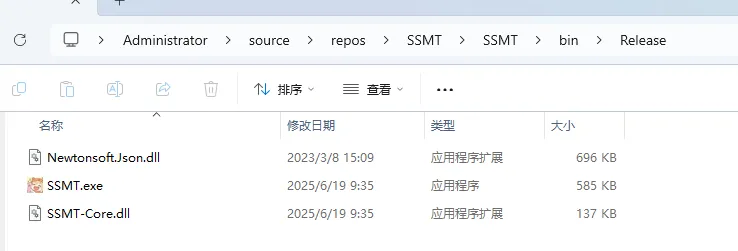

- SSMT自带的3DMigoto在SSMT-Package的3DMigoto目录下，可以选择采用SSMT自带的3DMigoto或你自己的3DMigoto。
- SSMT本体和SSMT blender插件的版本严格对应配套，如果发现不兼容，请同时更新到最新版。
- 请勿将SSMT-Package放到U盘或外接可插拔USB接口的硬盘里，否则会出问题，Dump内容全是软链接，从而失效（放到U盘中时，由于权限不足，即使不开启Symlink特性，Dump下来也是一堆链接文件，无法被SSMT识别）。

# (0) 第一次安装

[点此直达SSMT-Package GitHub仓库链接](https://github.com/StarBobis/SSMT-Package)

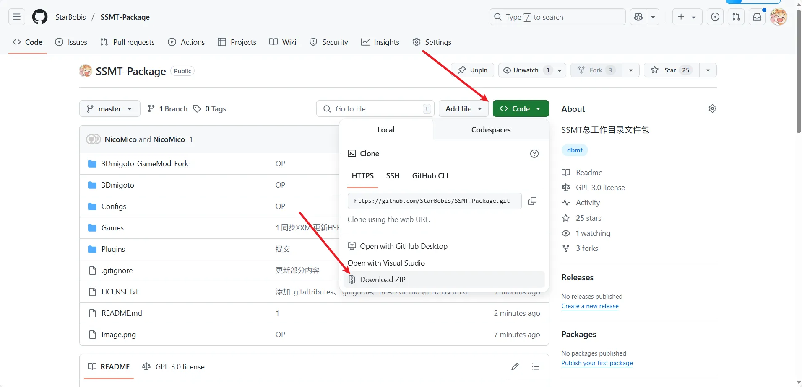

按图所示下载SSMT-Package，SSMT本体依赖于此处内容，且经常更新，更新内容包含添加一些新的数据类型，或新的贴图配置等。下载完成后，解压文件于任定目录，但不可置于U盘或外置热插拔USB接口磁盘中（注意 Type-C 全称 USB Type-C），路径不可包含中文。下面的示例中，我直接放在桌面的一个目录下：

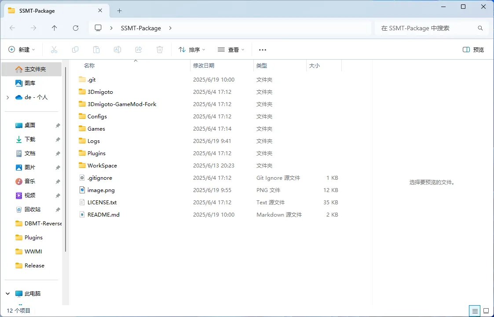

[点此直达SSMT GitHub仓库链接](https://github.com/StarBobis/SSMT)

于 Release 中下载并解压最新版本的 .zip 文件，解压要求同 SSMT-Package。打开根目录下的 SSMT.exe，点击设置 -> 首选项：

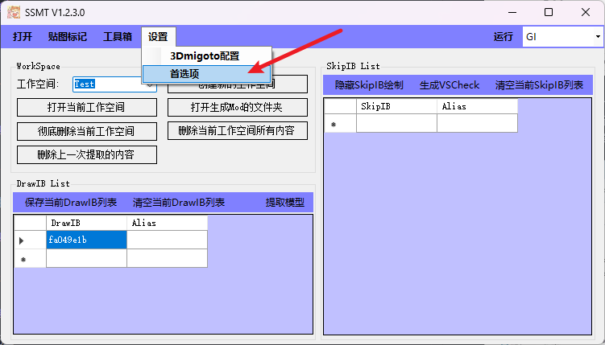

在这一界面，选择 SSMT-Package 文件夹路径为前面下载解压后你自行放置的 SSMT-Package 文件夹路径：

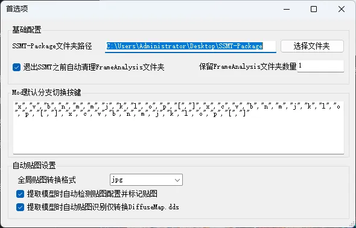

关闭窗口即可保存设置，此后可以正常使用SSMT。

# (1) 选择游戏

点击右上角下拉菜单，选择需要当前工作的游戏：

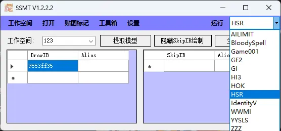

# (2) 进行3DMigoto配置

启动SSMT后，大致用户界面如下图：

此时须先配置 3DMigoto：

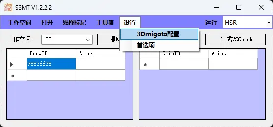

选择3DMigoto文件夹。因为SSMT依赖于3DMigoto运行，这里可以选一个当前游戏对应的3DMigoto，比如我这里直接用一个下载于桌面的：

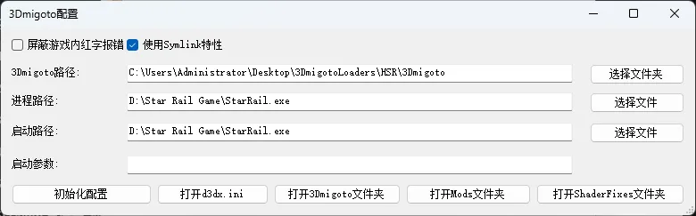

SSMT自带的若干3DMigoto在 `SSMT-Package\Games\` 目录下，尽量不要使用其它人提供的3DMigoto否则可能不适配：

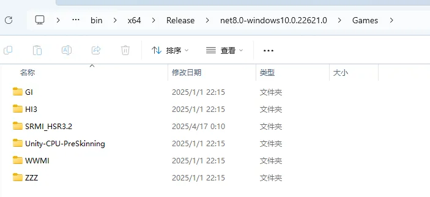

选择后，3DMigoto路径，进程路径和启动路径，以及启动参数会自动从你选择的3DMigoto文件夹中的d3dx.ini中识别并填写（如果是空的，请看后续如何填写的教程）。

随后就可以关闭此窗口，去主页界面开始使用了。

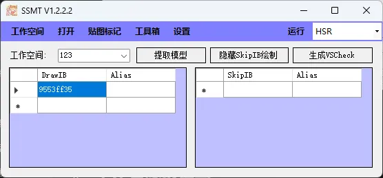

# (3) 各参数填写

这里的进程路径，对应d3dx.ini中的target =
启动路径对应d3dx.ini中的launch =
启动参数对应d3dx.ini中的launch_args =

## 进程路径

一般是目标游戏的主程序的路径
一般米游的进程路径和启动路径填写相同的即可，米游不需要填写启动参数，除非你有自定义的需求，那么请自行填写。

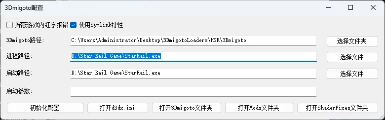

## 启动路径

一般为游戏的启动器或者进程路径。
米游比较特殊，它允许不经过官方启动器直接调起进程启动，但是其它游戏不一定允许，所以这里的启动路径，一般我们填写的是能够调起这个游戏的游戏的启动器路径。

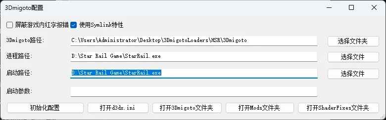

## 启动参数

虽然有些游戏不允许直接启动它的进程路径，但是当你附加了启动参数之后，是可以直接启动进程路径的，比如Naraka：

例如进程路径和启动路径相同，代表我要在运行3DMigoto Loader之后，立刻调起游戏进程路径并进行注入，正常情况没有启动参数是会报错失败的，但是我们通过Process Hacker、Open Ark等工具获取了进程的启动参数后，就可以实现方便的一键调起游戏了。

## 如何查找游戏的进程路径

(进程路径 即 d3dx.ini中的target = 路径)

这里我们填写的target = 后面的路径，是游戏进程的文件所在路径，一般情况下我们可以通过任务管理器查到。

首先启动游戏，以ZZZ为例，可以在进程中看到它：

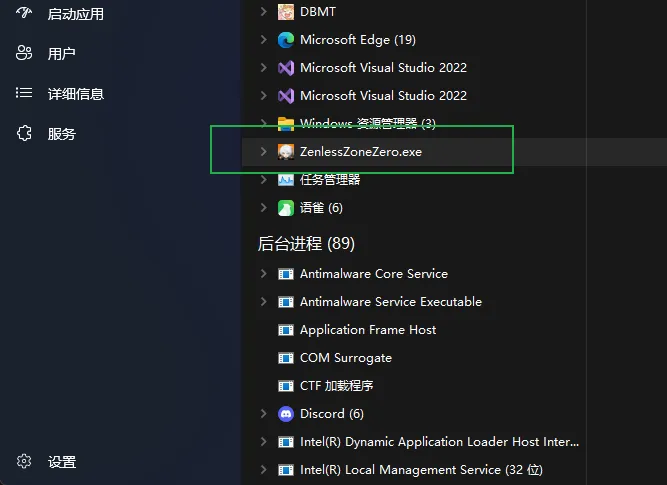

右键，打开文件所在位置：

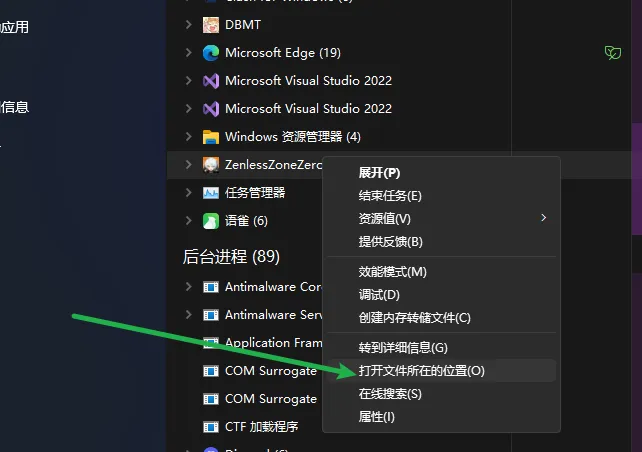

出来如下内容，文件名会被自动选中：

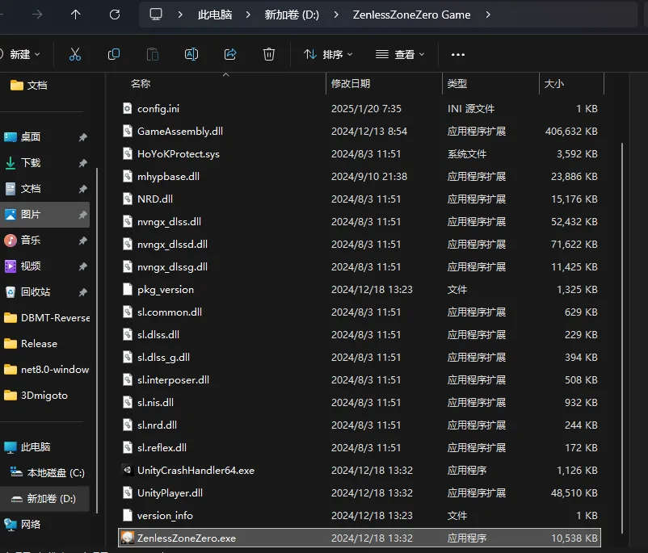

此时我们可以从地址栏得到：

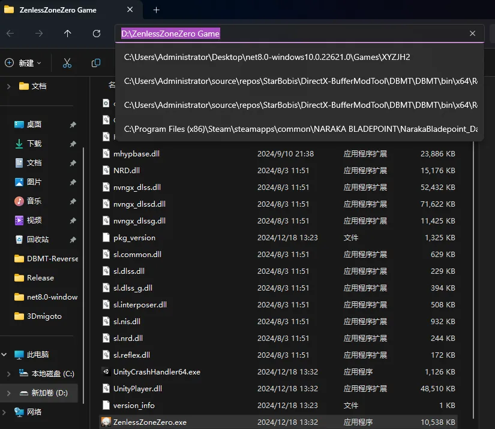

D:\ZenlessZoneZero Game

此时拼接路径和文件名即可得到完整路径：

D:\ZenlessZoneZero Game\ZenlessZoneZero.exe

## 什么情况下进程路径和启动路径相同

如果游戏的进程能够在不附加任何启动参数的情况下，被第三方程序启动，那么此时进程路径和启动路径就可以填一样的，就可以点击 启动3DMigoto Loader.exe后自动启动游戏了。

否则则需要特定启动参数，可以用ProcessHacker自行查看并添加（看不懂说明你用不到这个特性，无需考虑这个）。
